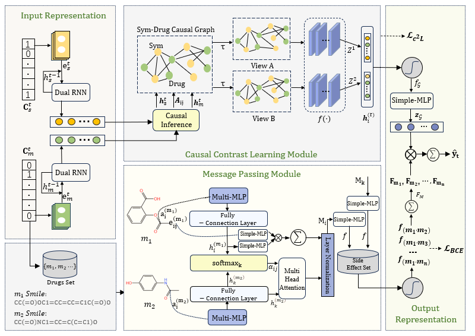

# C<sup>2</sup>LNet
C<sup>2</sup>LNet:A Causal Contrast Learning Network for Drug Recommendationon


## Overview
This repository contains code necessary to run C<sup>2</sup>LNet model. C<sup>2</sup>LNet is a causal contrast learning network for drug recommendation, as shown in the following Figure1.The model consists of three components:(1) medical embedding module: extracting symptom and drug information from patient's EHRs and embedding the symptom and drug information using Dual-RNN, respectively; (2)causal contrast learning module:firstly, utilizing attention mechanism to make causal inference, constructing a symptom-drug causal graph. Then the symptom-drug causal graph is randomly augmented to contrast and learn the correlation representation of symptoms and drugs. In this way, the recommendation bias caused by data sparsity problem is eliminated. (3)Message passing module: according to the SMILES sequence, the corresponding drug information is transformed into drug molecular graph. The multiMLP are utilized to compute inter-drug messaging and predict inter-drug side effect scores, thus achieving more accurate and safer drug combination recommendations. 



## Requirements
We need to install the following important packages.
- pip install torch  # version >= '1.10.1+cu113'
- pip install nltk
- pip install transformers
- pip install scikit-learn==0.24.2
- conda install -c conda-forge rdkit
- cd ./data/mimic-iii/fariseq && pip install ./

## Running the code
### Data preprocessing
### Dataset Preparation 
Download the MIMIC-III and MIMIC-IV datasets.
+ MIMIC-III: https://physionet.org/content/mimiciii/1.4/
+ MIMIC-IV: https://physionet.org/content/mimiciv/

Get the following input files from SafeDrug: https://github.com/ycq091044/SafeDrug.
+ RXCUI2atc4.csv: NDC-RXCUI-ATC4 mapping
+ rxnorm2RXCUI.txt: NDC-RXCUI mapping
+ drugbank_drugs_info.csv: Drugname-SMILES mapping
+ drug-atc.csv: CID-ATC mapping
+ drug-DDI.csv: DDI information coded by CID

Then,put them in the folder **./data/input/**.
All files generated in the following steps are placed in the output folder **./data/mimic-iii/output/**.
### Step 1: Load the data and merge the original tables.
After downloading the raw dataset, put these required files in the folder path: **./data/mimic-iii/**.
+ DIAGNOSES_ICD.csv, PROCEDURES_ICD.csv, PRESCRIPTIONS.csv
+ D_ICD_DIAGNOSES.csv, D_ICD_PROCEDURES.csv 
+ NOTEEVENTS.csv, ADMISSIONS.csv

Run **processing_sym.py** to generate **symptom.pkl**, the merged data frame without symptom information.
```
cd ./data/mimic-iii/
python processing_sym.py
```

### Step 2: Symptom extraction
Run **sym_information.py** to generate **data_sym_information.pkl** by extracting symptom information from clinical notes and admission tables, and removing the patients with only a single visit or no symptom.
```
python sym_information.py
```

### Step 3: Tokenization for symptom and medication
We employ the Clinical BERT (https://github.com/EmilyAlsentzer/clinicalBERT) to tokenize the text of symptoms and procedures by running **input_ids_sdp_iii.py**. 

We employ a roberta-large based pre-trained model (https://github.com/microsoft/DVMP, checkpoints need to be registered by their authors) to tokenize SMILES strings of medications and encode them by running **input_smiles_iii.py**.
```
python input_ids_sdp_iii.py
python input_smiles_iii.py
```

### Step 4: Additional symptom information
Run **sym_additional.py** to generate additional symptom information used for the input of model training and inference.
```
python sym_additional.py
```

 ### C<sup>2</sup>LNet Training and Inference
 ```
python main.py --model_name [YOUR_MODEL_NAME]
 ```
 ### C<sup>2</sup>LNet Test
 ```
 python main.py
 
--Test                test mode
  --model_name MODEL_NAME
                        model name
  --resume_path RESUME_PATH
                        resume path
 ```